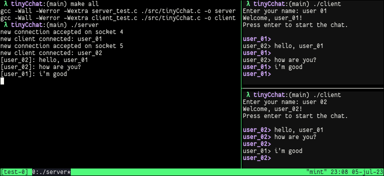

## tinyCchat

tinyCchat is a simple chat application implemented in C using sockets. It consists of a
server component and a client component that allows users to communicate with each other
over a network.

- `tc_server_run`: server function
   - Launches the server and listens for incoming client connections.
   - Manages the communication between multiple clients.
   - Broadcasts messages from one client to all other connected clients.

- `tc_client_connect`: client function
   - Connects a client to the server.
   - Allows the client to send and receive messages to/from other connected.

Example:

